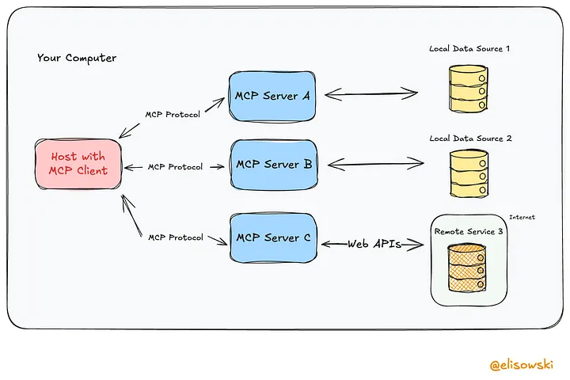

# Agentic AI

## 1. What is Agenitc AI?

Agentic AI refers to AI systems that can operate with a degree of independence, making decisions and taking actions to achieve specific goals.

### Key Aspects

- **Autonomy**: The ability to function without continuous human interaction.
- **Goal-oriented behavior**: Setting and pursuing objectives based on predefined or evolving goals.
- **Adaptability**: Responding to changing environments and learning from past interactions.
- **Interoperability**: Ability to use different data sources, tools, and platforms to enhance decision-making.

## 2. Protocols for the Communications

### MCP

The Model Context Protocol (MCP), introduced by Anthropic, defines a standardized interface for supplying structured, real-time context to large language models (LLMs).

### ACP

The Agent Communication Protocol (ACP) is an open standard originally proposed by BeeAI and IBM to enable structured communication, discovery, and coordination between AI agents operating in the same local or edge environment.

### A2A

The Agent-to-Agent (A2A) Protocol, introduced by Google, is a cross-platform specification for enabling AI agents to communicate, collaborate, and delegate tasks across heterogeneous systems.

### Differencre Between MCP, A2A and ACP

## 3. Frameworks

Consider your development team’s skill level. A beginner-friendly AI framework such as CrewAI, for example, has a no-code interface for rapid prototyping and ready-made AI agent templates for swift deployment.

More experienced AI developers might go for advanced agent frameworks such as LangGraph that offer low-level control and customizable code options.

### I. Key Selection Criteria

When choosing a framework, consider:

- **Complexity**: Single vs. multi-agent systems (e.g., customer support vs. supply chain management).
- **Security**: Encryption, access controls, and data privacy.
- **Ease of Use**: No-code tools (e.g., CrewAI) vs. customizable code (e.g., LangGraph).
- **Integration**: Compatibility with existing tech stacks (APIs, cloud/on-prem deployment).
- **Scalability**: Performance under high data volumes or concurrent tasks.

---

### II. Leading Open-Source Frameworks

| Framework              | Key Features                                                     | Best For                                     |
|------------------------|------------------------------------------------------------------|----------------------------------------------|
| **AutoGen (Microsoft)**| Multi-agent layers (Core, AgentChat, Extensions); debugging tools| Conversational AI, code automation           |
| **CrewAI**             | Role-based agents (e.g., Analyst, Researcher); sequential/hierarchical workflows | Team collaboration (e.g., stock analysis) |
| **LangChain**          | Modular components for LLM apps; supports simple agents          | Custom chatbots, document processing         |
| **LangGraph**          | Graph-based workflows (nodes = tasks, edges = transitions)       | Non-linear processes (e.g., travel booking)  |
| **LlamaIndex**         | Event-driven architecture; async workflows                       | Dynamic RAG applications                     |
| **Semantic Kernel (Microsoft)** | "Skills" and "planners" for enterprise apps             | Microsoft ecosystem integration              |

## References

### Articles

- [AI Agents vs Agentic AI](https://medium.com/@elisowski/ai-agents-vs-agentic-ai-whats-the-difference-and-why-does-it-matter-03159ee8c2b4)
- [A2A, MCP & ACP](https://medium.com/@elisowski/what-every-ai-engineer-should-know-about-a2a-mcp-acp-8335a210a742) :- Discussed how all protocols are differs.

- [Agentic AI Frameworks](https://www.ibm.com/think/insights/top-ai-agent-frameworks)

### Github Repository

- [Microsoft repo to start with agentic ai](https://github.com/microsoft/ai-agents-for-beginners?tab=readme-ov-file)