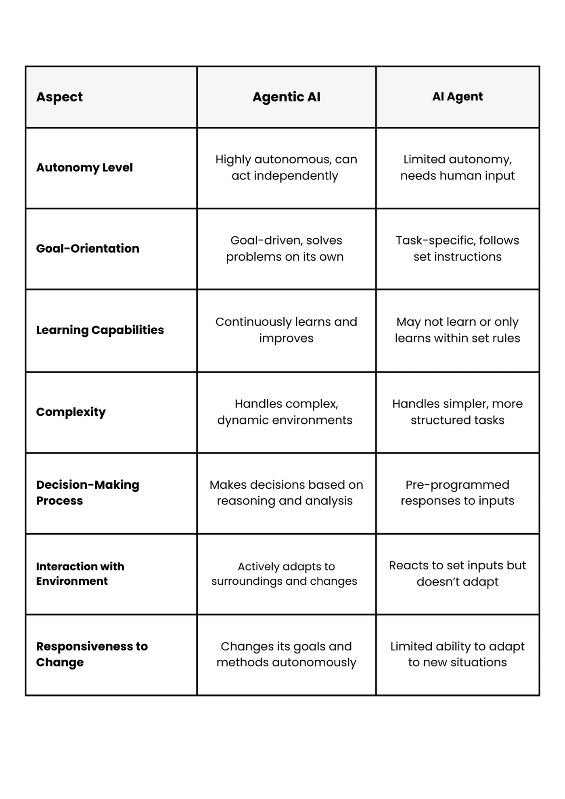

## 1. What is Agentic AI & AI Agents?

### AI Agents

AI Agents are designed to perform specific tasks, such as answering questions, organizing a calendar, or managing email. These agents automate simple, repetitive activities but lack the autonomy and decision-making capabilities of Agentic AI. Think of them as virtual assistants that follow direct instructions without independent reasoning.

### Agentic AI

Agentic AI refers to systems capable of independent decision-making and action toward achieving specific goals.

#### Key Characteristics

* **Autonomy**: Operates without continuous human input.
* **Goal-Oriented Behavior**: Pursues predefined or evolving objectives.
* **Adaptability**: Learns from interactions and adapts to new situations.
* **Interoperability**: Integrates with various tools, data sources, and platforms.

### Differences Between AI Agents and Agentic AI

---

## 2. Protocols for Communication

### MCP (Model Context Protocol)

Introduced by Anthropic, MCP defines a standard way to supply structured, real-time context to large language models.

### ACP (Agent Communication Protocol)

Proposed by BeeAI and IBM, ACP is an open standard for structured communication, discovery, and coordination among AI agents operating in local or edge environments.

### A2A (Agent-to-Agent Protocol)

Introduced by Google, A2A enables communication, task delegation, and collaboration across heterogeneous systems.

### Comparison of MCP, A2A, and ACP

---

## 3. Frameworks

Choose your framework based on your team’s skill level and project complexity.

### I. Key Selection Criteria

* **Complexity**: Single-agent vs. multi-agent systems.
* **Security**: Includes encryption, access control, and data privacy.
* **Ease of Use**: No-code tools (e.g., CrewAI, n8n, Langflow) vs. fully customizable code (e.g., LangGraph).
* **Integration**: Compatibility with APIs, cloud infrastructure, and other tech stacks.
* **Scalability**: Efficient performance with large-scale data and concurrent operations.

### II. Leading Open-Source Frameworks

| Framework               | Key Features                                          | Best For                                    |
| ----------------------- | ----------------------------------------------------- | ------------------------------------------- |
| **AutoGen (Microsoft)** | Multi-agent layers, debugging tools                   | Conversational AI, code automation          |
| **CrewAI**              | Role-based agents, hierarchical workflows             | Team collaboration (e.g., stock analysis)   |
| **LangChain**           | Modular LLM components, agent support                 | Custom chatbots, document processing        |
| **LangGraph**           | Graph-based workflows for task flow control           | Non-linear processes (e.g., travel booking) |
| **LlamaIndex**          | Event-driven and async architecture                   | Dynamic RAG applications                    |
| **Semantic Kernel**     | Skills and planners for enterprise applications       | Microsoft ecosystem integration             |
| **Langflow**            | Visual programming interface for LangChain agents     | No-code/low-code agent workflows            |
| **n8n**                 | Workflow automation with integrations and LLM support | No-code orchestration for data + agents     |

---

## References

### Articles

* [AI Agents vs Agentic AI](https://medium.com/@elisowski/ai-agents-vs-agentic-ai-whats-the-difference-and-why-does-it-matter-03159ee8c2b4)
* [Understanding A2A, MCP & ACP](https://medium.com/@elisowski/what-every-ai-engineer-should-know-about-a2a-mcp-acp-8335a210a742)
* [Top Agentic AI Frameworks](https://www.ibm.com/think/insights/top-ai-agent-frameworks)

### GitHub Repository

* [Microsoft - AI Agents for Beginners](https://github.com/microsoft/ai-agents-for-beginners?tab=readme-ov-file)
